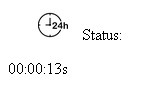

<h2>Cronometro</h2>
<h3>Cronometro que será implementando em forma de componente no VUEJS</h3>

Quando cliente começa uma atividade o cronometro se inicia automaticamente, ao cliente realizar a requisição para troca de atividade o cronometro reseta automaticamente e começa a contagem novamente.

Imagem do Cronometro